# Minimal HTTP Server to Web App on AWS

## 1. Project title and description

This is a small web application built on top of a hand-written, socket-based
HTTP server in Java - no Spring, no servlet container, no HTTP library. It
started as the one-request `HttpServer` example from the networking guide
(section 4.4) and grows it into something that can actually serve a page:
a sequential server that accepts many requests one after another, serves
static HTML/JS/PNG/JPEG resources, answers a handful of hardcoded JSON
services, and is driven by a small asynchronous JavaScript client so the
page never needs a full reload.

The point of the lab is not to build a production server - concurrency,
load balancing, and general-purpose routing are explicitly out of scope.
The point is to understand, end to end, what a browser, a URL, an HTTP
request/response, a server route, a content type, and a cloud host actually
do, by building the smallest version of each that still behaves correctly.

## 2. System metaphor and architecture

**System metaphor: a one-window ticket booth.**

There is a single clerk at the counter - the `HttpServer` accept loop - who
serves exactly one customer (one `Socket` connection) at a time, start to
finish, before calling the next person in line. Some customers just want a
flyer from the rack by the door: that's a static file request (`index.html`,
`app.js`, the logo/banner images), and the clerk just hands it over without
doing any real work. Other customers ask for one of a short list of favors
the clerk has memorized by heart - no lookup binder, no general request
router involved - "say hello to me" (`/greeting`), "square this number for
me" (`/square`), "what time do you have" (`/time`), "are you actually open"
(`/health`). That memorized list is exactly `Router`'s explicit if/else
chain.

The customer's assistant (the browser's JavaScript, `app.js`) can chat on
their phone while waiting in line - `fetch()` calls are asynchronous, so the
page stays interactive - but the booth itself is still one window. If the
person ahead asks for something slow (the `/slow` demo endpoint), everyone
behind them really does wait, no matter how responsive their own phone
feels. That is the whole sequential-vs-asynchronous distinction this lab is
built to make visible.

**Architecture:**

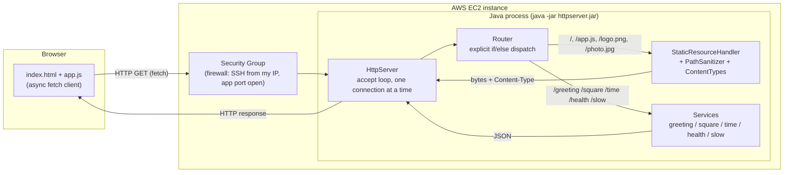

Component responsibilities:

| Component | Responsibility |
|---|---|
| Browser client (`index.html`, `app.js`) | Renders the page, sends async `fetch` requests, updates only the result/error area, never reloads. |
| Security group | The instance-level firewall: only SSH (from the developer's IP) and the app port are open. |
| `HttpServer` | Binds the listening socket and runs the accept loop - one connection fully handled before the next is accepted. |
| `HttpRequest` / `HttpResponse` | Parse a request line + query string; write a response as raw, correctly-typed, length-correct bytes. |
| `Router` | The single explicit if/else chain deciding which of the paths below handles a request. |
| `StaticResourceHandler` / `PathSanitizer` / `ContentTypes` | Serve files bundled under `src/main/resources/public`, safely. |
| Services (`GreetingService`, `SquareService`, `TimeService`, `HealthService`, `SlowService`) | The hardcoded dynamic endpoints, each a plain static method. |

## 3. Design decisions

- **Why the server stays sequential.** This lab is explicitly about seeing
  the baseline before adding concurrency - `HttpServer.acceptLoop()` calls
  `serverSocket.accept()` and fully handles that connection before looping
  back to `accept()` again. No thread pool, no per-connection thread.
  `HttpServerIntegrationTest.serverIsSequentialASlowRequestBlocksTheNextOne`
  proves this with real timings, not just a description.
- **Why the routes are hardcoded.** `Router.route()` is one visible if/else
  chain over literal path strings. A reflection-based router, an annotation
  system, or a dependency-injection container would hide exactly the
  mechanism this lab is meant to expose, so none of that was added.
- **How content types are selected.** `ContentTypes.resolve()` maps a file
  extension to a MIME type from a small hardcoded table. The original
  prototype (`httpserver`'s first commit) hardcoded `text/html` for every
  response, including its one JSON endpoint - fixed here so every response
  carries the type that actually matches its bytes.
- **Binary-safety.** The prototype used a `PrintWriter` for every response
  body, which forces everything through a text `Charset` - safe for HTML,
  silently corrupting for a PNG/JPEG. `HttpResponse.writeTo()` now writes
  the body as the exact `byte[]` it was given, straight to the
  `OutputStream`, and computes `Content-Length` from that same array.
- **How unsafe paths are rejected.** Static resources are read from the
  classpath (`getResourceAsStream`, not a filesystem `Path`), because the
  same lookup then works identically from the IDE and from inside the
  packaged jar. Since there's no real filesystem path to canonicalize
  against, `PathSanitizer` resolves `.`/`..` segments itself and rejects
  anything that tries to climb above the resource root - `400 Bad Request`,
  kept deliberately distinct from a genuinely missing file's `404`.
- **Why the browser client is asynchronous.** `fetch()` lets the page stay
  interactive while a request is in flight; every form submit calls
  `event.preventDefault()` so the browser never navigates away, buttons show
  a disabled loading label mid-request, and a network failure (server
  unreachable) is reported with different wording than an HTTP error
  response, since they're genuinely different failure modes for the user.
- **No JSON library.** Each service builds a small, fixed-shape JSON string
  by hand and escapes any value that came from the client through
  `Json.escape()` - a full JSON writer would be more machinery than four
  small, hardcoded response shapes need.

## 4. Project structure

```
pom.xml                                    Maven descriptor (repo root, Java 21)
.gitignore
README.md

src/main/java/com/escuelaing/
    httpserver/                            The lab's server
        HttpServer.java                    accept loop, bind()/acceptLoop()/stop()
        HttpRequest.java                   request-line + query parsing
        HttpResponse.java                  status/headers/body, always byte-based
        Router.java                        explicit route dispatch
        ContentTypes.java                  extension -> MIME type
        PathSanitizer.java                 traversal-safe path normalization
        StaticResourceHandler.java         serves src/main/resources/public via classpath
        Json.java                          minimal JSON string escaping
        MalformedRequestException.java
        services/
            GreetingService.java  SquareService.java  TimeService.java
            HealthService.java    SlowService.java (demo-only, see section 6.2)
    guide/                                 Earlier networking-guide exercises (not the lab)
        EchoServer.java  EchoClient.java  ReadURL.java  URLReader.java

src/main/resources/public/                Static resources served by the app
    index.html  app.js  logo.png  photo.jpg

src/test/java/com/escuelaing/httpserver/  JUnit 5 tests (kept out of src/main)
    ContentTypesTest.java  PathSanitizerTest.java  JsonTest.java
    HttpServerIntegrationTest.java
    services/  (GreetingServiceTest.java, SquareServiceTest.java, ...)

deploy/                                    AWS deployment material
    run.sh  httpserver.service  ec2-setup.md

docs/evidence/                             Local test evidence (see section 11)
    local-curl-evidence.txt
```

## 5. Prerequisites

- JDK 21 or newer (built and tested with a JDK 21-targeted build; verify with `java -version`).
- Maven 3.9 or newer (`mvn -version`).
- Any modern browser.
- `curl` if you want to reproduce the manual evidence in `docs/evidence/`.
- An AWS account for section 10 (not needed to build, run, or test locally).

## 6. Installation and build

```bash
git clone <this-repository-url>
cd minimal-http-server-to-web-app-on-aws

mvn test      # compiles everything and runs the 53 unit + integration tests
mvn package   # produces target/httpserver.jar (runnable, resources included)
```

## 7. How to run locally

```bash
java -jar target/httpserver.jar          # listens on port 8080 by default
java -jar target/httpserver.jar 9000     # or choose a port as the first argument
PORT=9000 java -jar target/httpserver.jar  # or via an environment variable
```

Then open `http://localhost:8080/` (or whichever port you chose) in a
browser. Stop the server with `Ctrl+C` in the terminal it's running in.

## 8. How to use the application

The home page has four sections:

1. **Greeting service** - type a name, submit, and the result area shows
   `Hello, <name>!` from `GET /greeting?name=...`. Leaving it empty is
   rejected client-side (`required`) and, if bypassed, server-side too
   (`400` with a JSON `error`).
2. **Square service** - type a number, submit, and the result area shows
   its square from `GET /square?number=...`. A non-numeric value gets a
   friendly `400` error message instead of a raw stack trace.
3. **Server time** - one button, calls `GET /time`; the value comes from
   the server's clock, not the browser's.
4. **Sequential server demo** - calls the demo-only `GET /slow`, which
   sleeps 5 seconds before responding. It is **not** one of the four graded
   services; it exists so you can open this page in two browser windows,
   click it in one, and immediately click any other button in the other
   window - the second request visibly waits, because this server is
   sequential (see section 11 for a measured version of this same proof).

A small badge under the title calls `GET /health` once when the page loads
and shows the server's reported status. Every failure - invalid input, an
HTTP error status, or the server being unreachable - is shown in a
dedicated error area with a message distinct from the success area, and no
action ever reloads the page.

## 9. How to run the tests

**Automated (`mvn test`, 53 tests):**

- Unit tests with no sockets involved: `ContentTypesTest`, `PathSanitizerTest`
  (traversal vectors, encoded null bytes, backslashes, repeated slashes),
  `JsonTest`, and one test class per service - including `SquareServiceTest`
  cases for `NaN`, `Infinity`, and inputs whose square overflows to
  infinity, all of which must be rejected with `400` rather than produce a
  response that isn't valid JSON.
- `HttpServerIntegrationTest` starts the real server on an ephemeral port and
  drives it with `java.net.http.HttpClient`: every status code in the lab's
  test matrix (200/400/404/405), byte-for-byte image transfer, ten
  consecutive requests on one run, a raw-socket test that sends an invalid
  request line and confirms the server keeps answering afterward (section
  2.2's "a malformed request must not terminate the whole server"), a test
  that opens a connection and sends nothing to confirm the read timeout
  releases the server instead of freezing it forever, and a timed test that
  proves the sequential-blocking behavior with real measurements (a
  `/health` call issued while `/slow` is in flight has to wait several
  seconds).

Two real bugs were found this way after an initial self-review and fixed
before this line was written: `/square?number=NaN` (and `Infinity`, and any
input whose square overflows) used to serialize as a bare, invalid JSON
token; and a client that opened a connection without sending any data used
to block the entire server indefinitely (no read timeout). Both are covered
by the tests above and by items #18-19 in
[`docs/evidence/local-curl-evidence.txt`](docs/evidence/local-curl-evidence.txt).

**Manual (what you should also check yourself in an actual browser, per the
lab's own test matrix in section 6.1):**

| Test | How to check |
|---|---|
| Load home page | Open dev tools -> Network tab, reload, confirm separate 200s for `/`, `/app.js`, `/logo.png`, `/photo.jpg` with the right content types. |
| Valid greeting / square | Use the form, confirm the result area updates with no page reload. |
| Invalid number | Type letters into the square field, confirm a friendly error, not a stack trace. |
| Server time | Confirm the value is not simply `new Date()` from the browser (e.g. compare against your system clock offset). |
| Missing static file | Visit `/does-not-exist.html` directly, confirm `404`. |
| Unsupported method | From dev tools or `curl -X POST`, confirm `405` with an `Allow: GET` header. |
| Path traversal | `curl --path-as-is "http://localhost:8080/../pom.xml"`, confirm `400`, not the file's contents. |
| Two slow windows | Open the page twice, trigger the slow demo in one, click anything in the other - watch it wait. |

`docs/evidence/local-curl-evidence.txt` has a captured transcript of all of
the above run against the real packaged jar.

## 10. AWS deployment

The full step-by-step runbook is in [`deploy/ec2-setup.md`](deploy/ec2-setup.md);
this is the short version:

1. `mvn package` locally - only `target/httpserver.jar` needs to go to EC2,
   since the static resources are bundled inside it.
2. Launch one EC2 instance (Amazon Linux 2023, smallest approved size),
   with a security group open on SSH (from your IP only) and the app port.
3. Install Java 21 (`sudo dnf install -y java-21-amazon-corretto`).
4. `scp` the jar, `deploy/run.sh`, and `deploy/httpserver.service` to the
   instance, place the jar under `/opt/httpserver/`.
5. Install and start it as a systemd service (`deploy/httpserver.service`)
   so it survives logout and restarts on failure; logs go to
   `journalctl -u httpserver -f`.
6. Verify with `curl` from inside the instance, then from your own machine
   at `http://<instance-public-ip>:<port>/`.
7. When done, follow the mandatory cleanup checklist at the end of
   `deploy/ec2-setup.md` (stop the service, terminate the instance, release
   any Elastic IP, delete the security group, check billing).

No AWS account, address, or credential is (or should ever be) committed to
this repository.

**What was actually deployed:** one `t3.micro` instance running Amazon
Linux 2023 (`al2023-ami-2023.12...-kernel-6.18-x86_64`), region `us-east-1`,
with Corretto 21.0.12 installed via `dnf`. `target/httpserver.jar` was
transferred over SFTP, moved to `/opt/httpserver/httpserver.jar`, and
installed as the `httpserver` systemd service from
[`deploy/httpserver.service`](deploy/httpserver.service) - `journalctl -u
httpserver` confirms it starts under systemd and keeps logging real
requests, including one malformed request that it correctly ignored
without going down (see section 11 for the screenshots).

## 11. Evidence and results

**Local protocol/error evidence:**
[`docs/evidence/local-curl-evidence.txt`](docs/evidence/local-curl-evidence.txt) -
a full transcript, against the actual packaged jar, of the home page, every
static resource, all four services (valid and invalid input), the `/slow`
demo, missing files, an unsupported method, two path-traversal attempts, ten
consecutive requests, the `NaN`/`Infinity`/overflow fix on `/square`, the
idle-connection read-timeout fix, and a timed proof that a `/health` request
issued while `/slow` is in flight waits ~4.7s behind it.

**Remote (EC2) evidence** - captured end to end on the real deployment:

| # | Screenshot | What it shows |
|---|---|---|
| 1 | <a href="docs/evidence/01-ec2-instance-summary.png">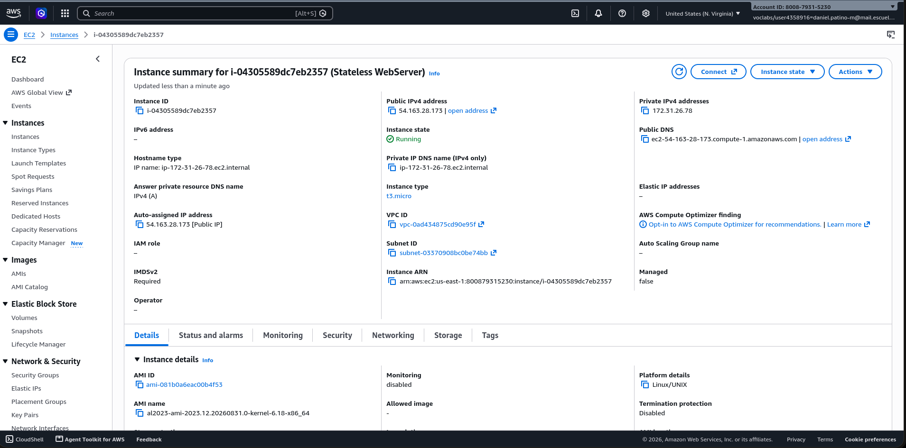</a> | Instance running: `t3.micro`, Amazon Linux 2023, public IPv4 assigned. |
| 2 | <a href="docs/evidence/02-ec2-instance-details.png">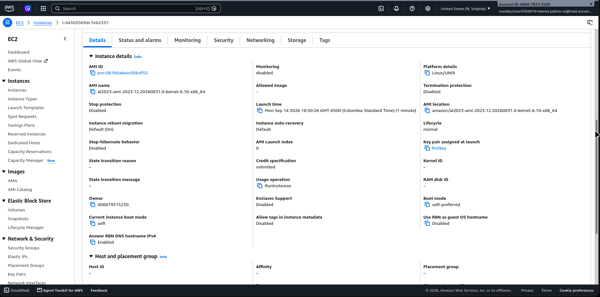</a> | AMI details and launch time. |
| 3 | <a href="docs/evidence/03-ec2-connect-to-instance.png">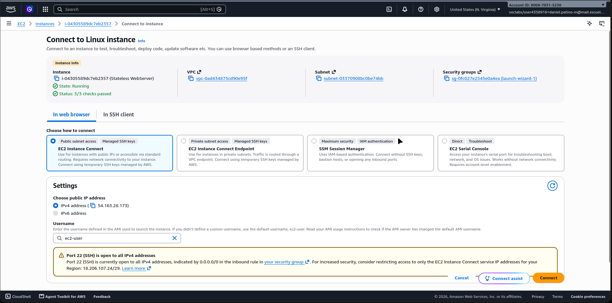</a> | EC2 Instance Connect page used to reach the instance. |
| 4 | <a href="docs/evidence/04-sftp-connect.png">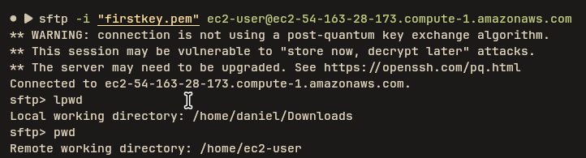</a> | SFTP session opened with the key pair. |
| 5 | <a href="docs/evidence/05-sftp-upload-jar.png">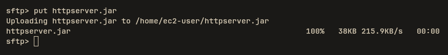</a> | `target/httpserver.jar` uploaded to the instance. |
| 6 | <a href="docs/evidence/06-ssh-list-uploaded-jar.png">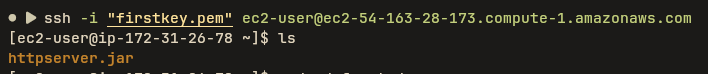</a> | SSH session confirming the jar landed on the instance. |
| 7 | <a href="docs/evidence/07-java-version-corretto21.png">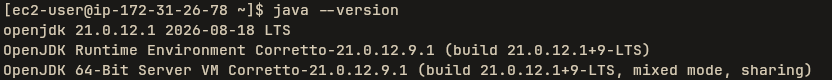</a> | `java --version` -> Corretto 21.0.12, matching the project's required runtime. |
| 8 | <a href="docs/evidence/08-manual-run-foreground.png"></a> | First manual run (`java -jar httpserver.jar`) - superseded by the systemd service below. |
| 9 | <a href="docs/evidence/09-app-home-page-on-ec2.png">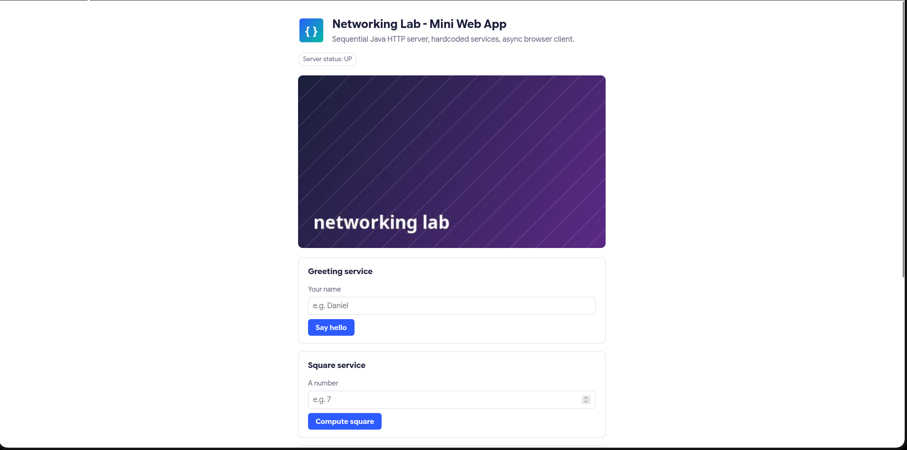</a> | The home page, loaded from the EC2 instance, with the `/health` status badge reading UP. |
| 10 | <a href="docs/evidence/10-security-group-inbound-rules.png">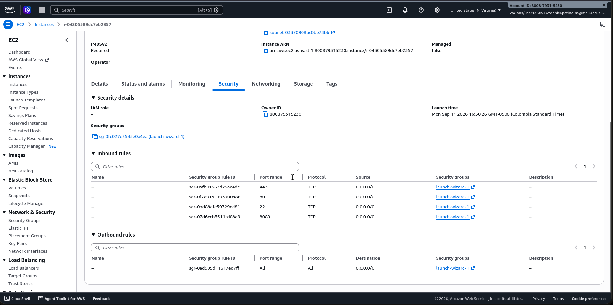</a> | The security group's inbound rules for this instance. |
| 11 | <a href="docs/evidence/11-services-working-on-ec2-with-server-log.png">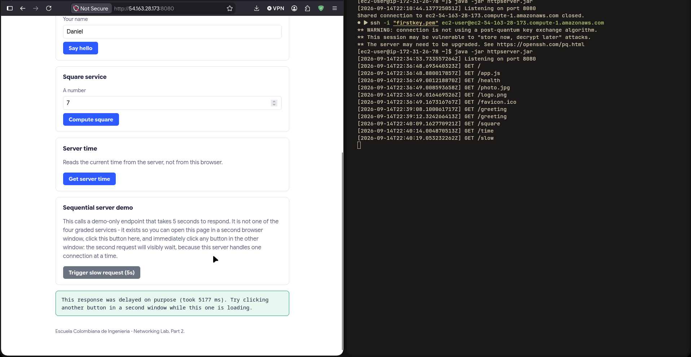</a> | Browser at `http://<public-ip>:8080` next to the live server log in the same SSH session - every click on the page (greeting, square, time, the slow demo) shows up as the matching `GET` line in real time. |
| 12 | <a href="docs/evidence/12-server-time-result-on-ec2.png">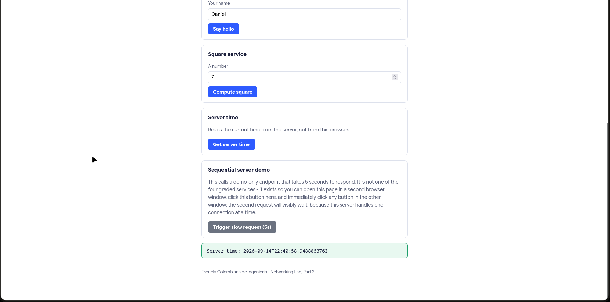</a> | `/time` result rendered in the page, sourced from the EC2 instance's clock. |
| 13 | <a href="docs/evidence/13-health-check-after-systemd-setup.png"></a> | `curl localhost:8080/health` succeeding after the app was installed as a systemd service. |
| 14 | <a href="docs/evidence/14-systemd-journalctl-log.png">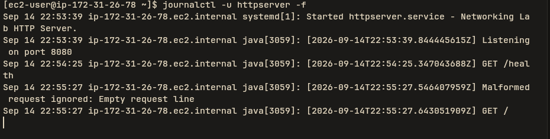</a> | `journalctl -u httpserver -f` - `systemd` starting `httpserver.service`, and, in real production traffic (not a test), a malformed request being logged and ignored right before the next normal `GET /` is served - the same resilience `HttpServerIntegrationTest.malformedRequestDoesNotCrashTheServer` checks, now observed live. |

Screenshots #9, #11, and #12 are the same live session against the public
EC2 address, in the order the services were exercised; the server log visible
in #11 lines up exactly with the requests those clicks generated.

**Mandatory cleanup (section 10)** - done after the evidence above was captured:

| Screenshot | What it shows |
|---|---|
| <a href="docs/evidence/15-ec2-instance-terminated.png">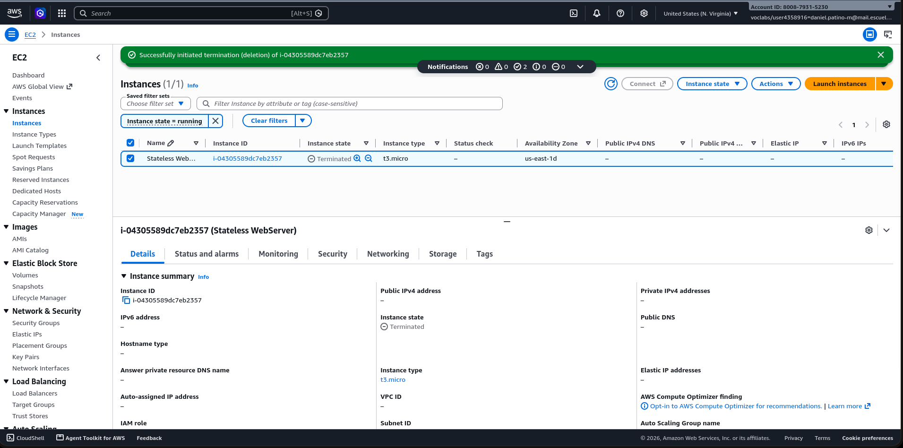</a> | The instance's state is `Terminated`. |
| <a href="docs/evidence/16-security-group-deleted.png">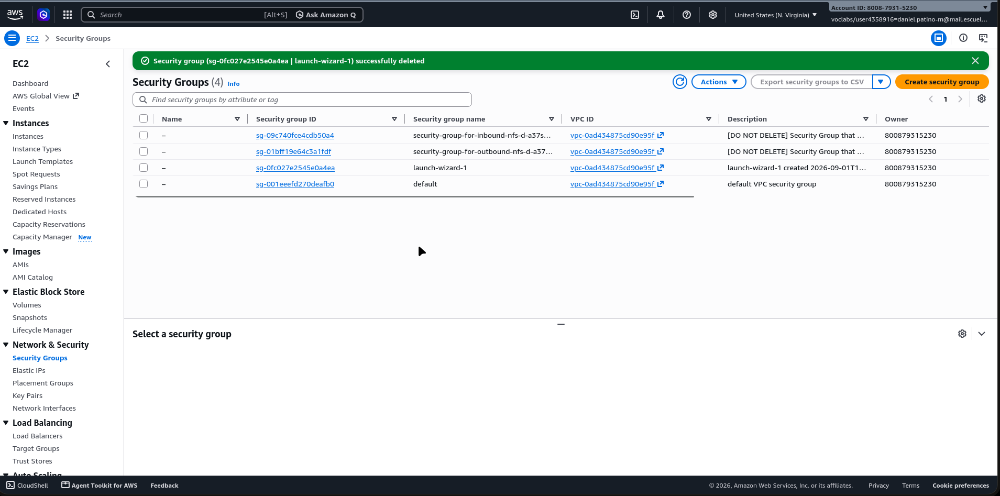</a> | The lab's `launch-wizard-1` security group has been deleted; only the account's pre-existing, unrelated `default`/NFS groups remain. |
| <a href="docs/evidence/17-billing-cost-zero.png">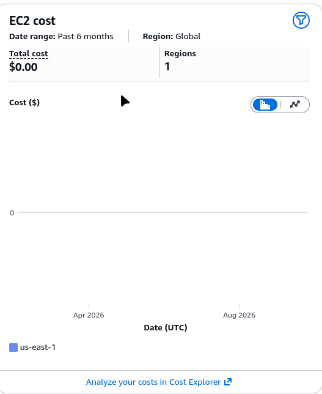</a> | EC2 cost for the account over the last 6 months: $0.00. |

No Elastic IP was allocated for this lab, so there was nothing to release.

## 12. Known limitations

- The server handles one connection at a time by design - there is no
  thread pool and no concurrency of any kind.
- Only `GET` is implemented; every other method returns `405`.
- Only five paths are recognized (`/greeting`, `/square`, `/time`,
  `/health`, `/slow`); everything else falls through to static file lookup.
- No persistence, no authentication, no TLS, no production hardening of any
  kind - this is a teaching artifact, not a server meant to face the public
  Internet beyond the scope of this lab.
- `/slow` is a demo-only endpoint added purely to make section 6.2's claim
  observable; it is not one of the four graded services.

## 13. Reflection: discussion questions

1. **Why does a single HTML page cause several HTTP requests?** An HTML
   document is just text describing structure; every resource it references
   (`<script src="/app.js">`, ``) has its own URL and
   needs its own request once the browser parses that tag. "Loading one
   page" is really the sum of one request per referenced resource - the
   server log in `docs/evidence/local-curl-evidence.txt` shows exactly that:
   `/`, `/app.js`, `/logo.png`, and `/photo.jpg` each show up as separate
   `GET` lines.

2. **Why must image responses be treated as bytes rather than text?**
   PNG/JPEG bytes aren't valid text in any character encoding. The
   prototype this lab started from used a `PrintWriter` for every response,
   which pushes everything through a `Charset` before writing it - fine for
   HTML, silently corrupting for an image. `HttpResponse.writeTo()` writes
   the body as the exact `byte[]` it was given; I confirmed this by
   comparing a downloaded `/logo.png` against the source file with `cmp`
   and getting an exact match.

3. **What is the role of the response content type?** It's the only signal
   telling the browser how to interpret the bytes it received - the same
   bytes could be shown as text, parsed as HTML, run as JavaScript, or
   decoded as an image depending only on that header. The original
   prototype hardcoded `text/html` even for its one JSON response, which
   happened to work only because browsers are forgiving about sniffing
   JSON as text.

4. **What is hardcoded in this design, and what would a routing framework
   eventually generalize?** `Router.route()` is one explicit if/else chain
   matching literal path strings to a specific service. A routing framework
   would generalize the path-to-handler lookup itself (path templates,
   verb-dispatch tables, middleware), usually through reflection or
   annotations, so adding a route wouldn't mean touching a shared block of
   code. That generalization is exactly what this lab asked to leave out.

5. **Why can the browser stay responsive while the server handles requests
   sequentially?** Responsiveness is a property of the browser's own
   single-threaded event loop, not of the server. `fetch()` is asynchronous:
   it hands the network call off and returns control to the page
   immediately. That's a separate concern from what the server does with
   the socket once a request arrives - `HttpServer.acceptLoop()` still
   finishes one connection before starting the next, which
   `HttpServerIntegrationTest.serverIsSequentialASlowRequestBlocksTheNextOne`
   and the local evidence capture both measure directly.

6. **What changed when the server moved to EC2? What did not change?**
   What changed is the network boundary: `localhost:8080` became
   `54.163.28.173:8080`, the loopback interface was replaced by a real NIC
   sitting behind a security group acting as a firewall (section 11, #10),
   and I had to install a JVM on the instance myself instead of using the
   one already on my laptop (`java --version` -> Corretto 21.0.12, section
   11 #7 - same major version I built and tested against locally). What did
   not change is the code or its behavior at all: it's the exact same
   `target/httpserver.jar`, uploaded once over SFTP, and it still runs as
   one accept loop handling one connection at a time - the `/slow` demo
   still blocks other requests on EC2 exactly like it does locally (section
   11, #11). One thing I didn't originally plan for: running it manually
   over SSH meant it would have died the moment I disconnected (section 11
   #8), which is exactly why section 7.4 asks for a real background
   service - installing `deploy/httpserver.service` under systemd fixed
   that, and `journalctl -u httpserver` (#14) even caught a malformed
   request in real production traffic and logged it without the server
   going down, the same behavior `HttpServerIntegrationTest` checks
   locally.

7. **What happens when two users send slow requests at almost the same
   time?** Measured directly rather than guessed: in
   `docs/evidence/local-curl-evidence.txt` (#17), firing `/slow` and then,
   300ms later, `/health` against the same running server, `/health` didn't
   return for about another 4.7 seconds - it was sitting in the OS's
   connection backlog because `acceptLoop()` was still inside
   `handleConnection()` for `/slow` and hadn't called `accept()` again yet.
   With two real users, the second one's browser just waits with nothing to
   show, however busy their own JavaScript looks, until the first request
   finishes and the accept loop gets back around to them.

8. **What is the next architectural limitation you would address, and why
   should concurrency come before load balancing?** The very next
   limitation is what this lab deliberately left out: one JVM handling one
   connection at a time. Concurrency has to come before load balancing
   because load balancing only helps once there is more than one thing
   capable of doing work in parallel - spreading requests across several
   sequential servers just relocates the same one-at-a-time bottleneck to N
   places instead of removing it. Concurrency is what makes a single
   instance worth replicating in the first place.

## 14. Author and acknowledgment

**Author:** Daniel Patiño Mejia.

**Acknowledgments:**

- Guide and lab statement by Luis Daniel Benavides Navarro, Escuela
  Colombiana de Ingeniería (networking guide and lab document for this
  course).
- The original `HttpServer.java` prototype in the project history is
  adapted from the Java networking tutorials at
  `docs.oracle.com/javase/tutorial/networking`, as credited in the course
  guide.

